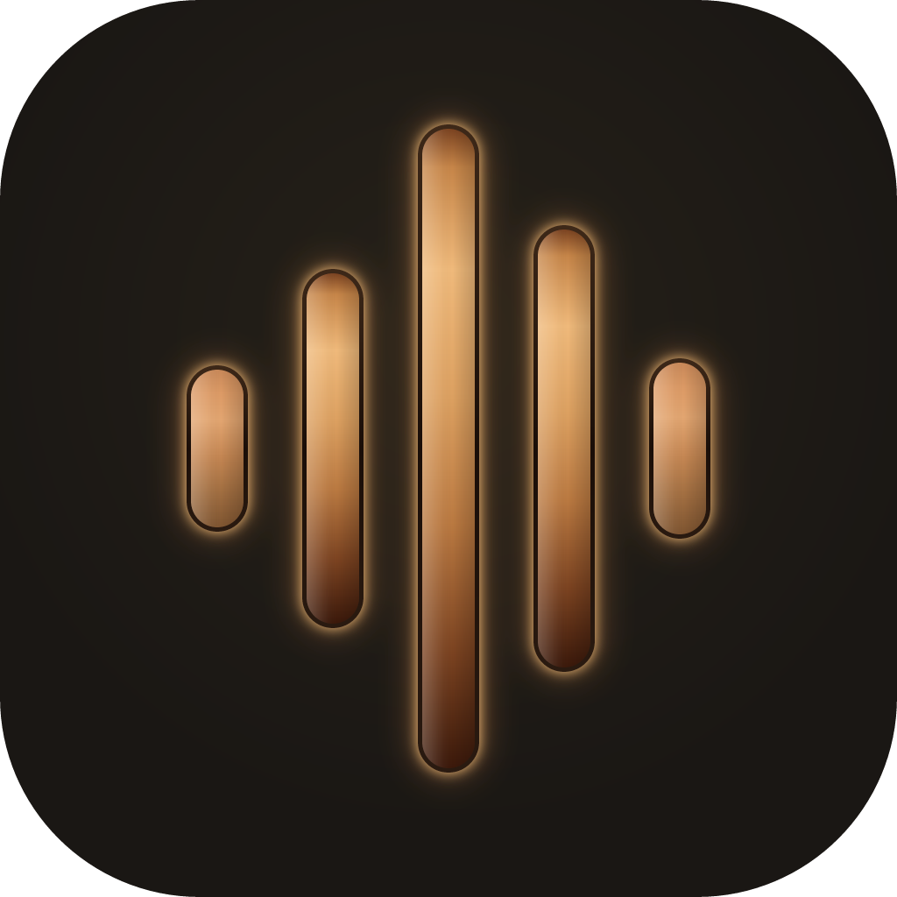
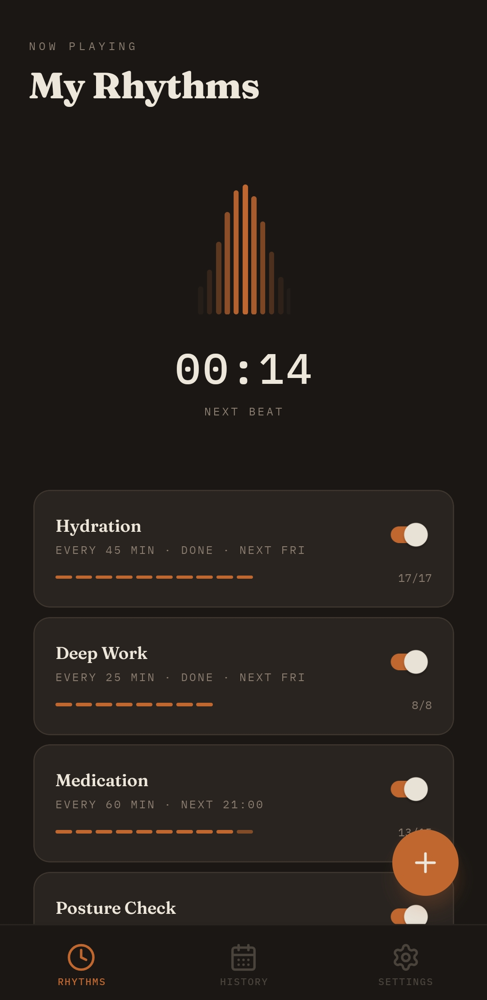
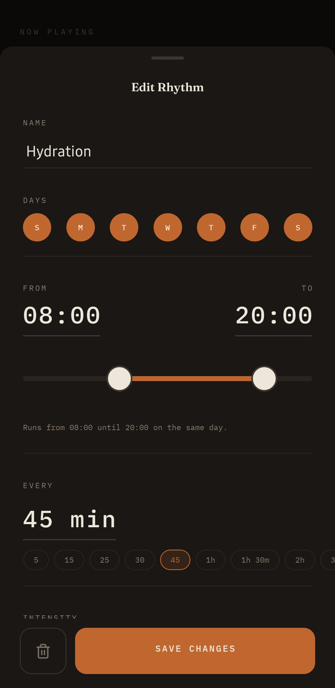
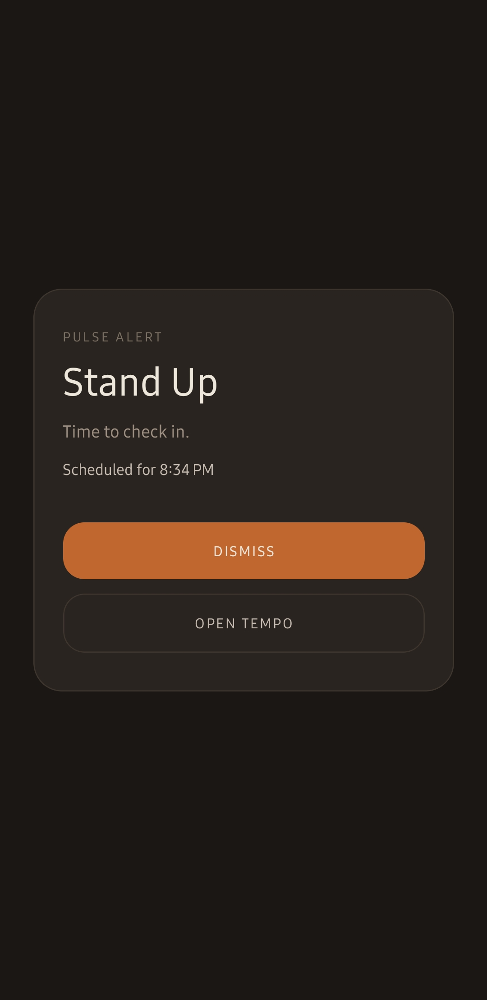

  

<h1 align="center">Tempo</h1>

  <strong>Repeating alarms with real intensity control.</strong> 
  From a whisper to a full call. Local-first. Open source.

  
  
  

 

Most reminder apps send you a notification and hope you notice. Tempo gives you a dial. Four intensity levels so every alarm hits exactly as hard as it should.

  
  &nbsp;&nbsp;
  
  &nbsp;&nbsp;
  

## 🚀 Get Started

...or download the APK from [GitHub Releases](https://github.com/giacomoguidotto/tempo/releases)!

## ✨ Features

- **Rhythms, not one-off alarms.** Set the days, time window, and interval. Tempo repeats it for you.
- **Four intensity levels.** From a silent vibration (Whisper) to a persistent alarm you must dismiss (Call).
- **A live VU meter.** See your next beat approaching in real time on the home screen.
- **Alarms that actually fire.** Exact Android alarms, foreground services, battery-optimization bypasses. Survives Doze mode, app kills, and device restarts.
- **No accounts. No cloud. No ads.** Your data stays on your device. Nothing leaves your phone.

## 🔍 Under the Hood

Tempo is built with [Expo](https://expo.dev) and [React Native](https://reactnative.dev). Alarms are powered by [Notifee](https://notifee.app) with exact scheduling, foreground services, and full-screen intents for high-intensity levels. All data is stored locally using SQLite (via [Drizzle](https://orm.drizzle.team)) and [MMKV](https://github.com/mrousavy/react-native-mmkv).

Free and open source. See [CONTRIBUTING.md](.github/CONTRIBUTING.md) to get involved.
