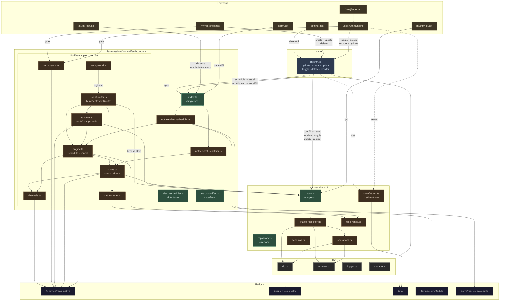

# Architecture

## Reading the diagram

**Green nodes** are public interfaces — the narrow seam. Callers outside a module only touch these.

**Brown nodes** are implementations hidden behind the interface. Swapping Notifee means rewriting these inside `features/beat/`, nothing outside changes.

**Blue node** is the store — the single coordination point for UI mutations. It orchestrates repository, scheduler, status notifier, and atom state in one call.

**Gold nodes** are UI screens and hooks. They reach the system through the store (mutations) or through interfaces directly (reads, alarm screen actions).

### Two entry paths

| Path | Goes through | Example |
|---|---|---|
| **Foreground (UI)** | `useRhythmEngine` / `rhythm-sheet` → `rhythmStore` → interfaces | User toggles a rhythm |
| **Background** | `background.ts` → `event-router` → interfaces directly | A beat fires while app is backgrounded |

Background handlers bypass the store to avoid circular dependencies — they call `rhythmRepository`, `engine`, and `status` directly.

### Notifee containment

Everything inside the dashed boundary imports `@notifee/react-native`. Nothing outside it does. On swap day, rewrite the internals of `features/beat/`, change two constructor calls in `index.ts`, done.
