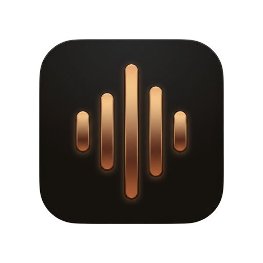
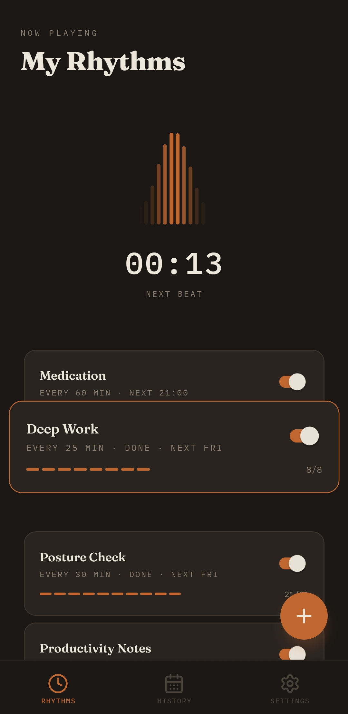
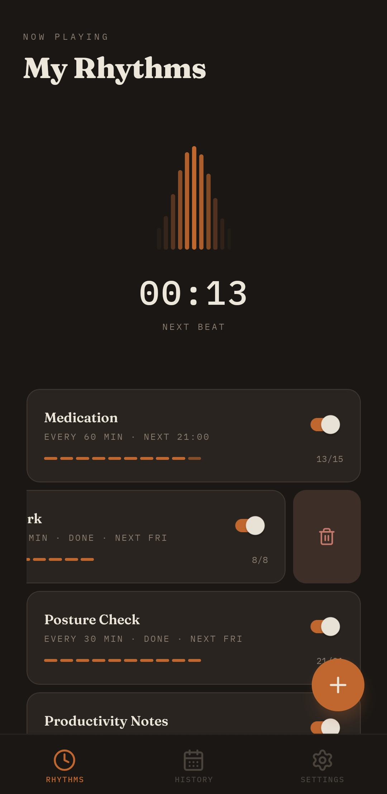

# Google Play Store Listing

## App name

Tempo

## Icon

## Short description

Repeating alarms with real intensity control. From a whisper to a full call.

## Full description

Most reminder apps send you a notification and hope you notice. Tempo gives you a dial.

Set repeating alarms that actually match the urgency. A gentle vibration for hydration. A full-screen takeover for medication. Four intensity levels -- Whisper, Nudge, Pulse, Call -- so every reminder hits exactly as hard as it should.

INTENSITY YOU CONTROL

Whisper: a silent pulse. You feel it, nobody else does.
Nudge: vibration and a short sound. Enough to break a trance.
Pulse: sound, vibration, and a full-screen overlay that lights up your lock screen.
Call: persistent sound and vibration until you physically dismiss it. For the things you cannot miss.

ALARMS THAT ACTUALLY FIRE

Tempo uses exact Android alarms, foreground services, and battery-optimization bypasses. Your reminders survive Doze mode, app kills, and device restarts. When you set every 25 minutes, you get every 25 minutes.

A LIVE COUNTDOWN YOU CAN FEEL

A VU meter on the home screen shows your next beat approaching in real time. No need to open the app and wonder -- glance at the needle and know.

BUILT AROUND YOUR DAY

Every rhythm has a schedule: which days, what hours, what interval. A deep work cycle on weekday mornings. A stretch break during the afternoon. A wind-down reminder in the evening. Set them once and forget them.

NO ACCOUNTS. NO CLOUD. NO ADS.

Your rhythms stay on your device. Nothing leaves your phone. Nothing tracks you.

Free and open source.

## Screenshots

| # | File | Feature |
|---|------|---------|
| 1 |  | Home screen with VU meter countdown and rhythm list |
| 2 |  | Edit rhythm: days, time window, interval, intensity |
| 3 |  | Rhythm selected with progress bars |
| 4 |  | Swipe-to-delete gesture on a rhythm |
| 5 |  | Full-screen Pulse alert with dismiss action |
